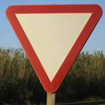
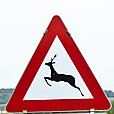
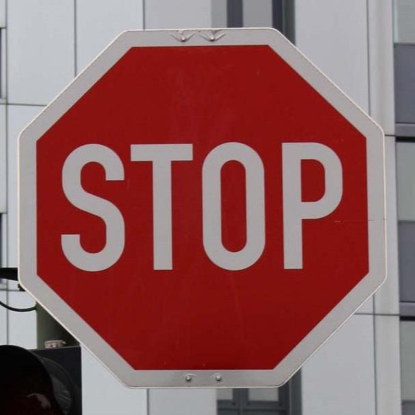
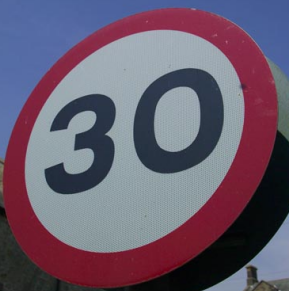
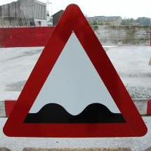
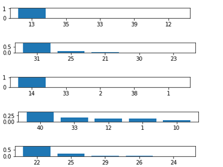

#**Traffic Sign Recognition** 

---

**Build a Traffic Sign Recognition Project**

The goals / steps of this project are the following:
* Load the data set (see below for links to the project data set)
* Explore, summarize and visualize the data set
* Design, train and test a model architecture
* Use the model to make predictions on new images
* Analyze the softmax probabilities of the new images
* Summarize the results with a written report

[//]: # (Image References)

[histogram]: ./docs/histogram.png "Histogram"
[training_chart]: ./docs/training_chart.png "Training Chart"
[image2]: ./examples/grayscale.jpg "Grayscaling"
[image3]: ./examples/random_noise.jpg "Random Noise"

## Rubric Points
###Here I will consider the [rubric points](https://review.udacity.com/#!/rubrics/481/view) individually and describe how I addressed each point in my implementation.  

---
###Writeup / README

####1. Provide a Writeup / README that includes all the rubric points and how you addressed each one. You can submit your writeup as markdown or pdf. You can use this template as a guide for writing the report. The submission includes the project code.

You're reading it! and here is a link to my [project code](https://github.com/Maesla/Traffic-Sign-Classifier/blob/master/Traffic_Sign_Classifier.ipynb)

###Data Set Summary & Exploration

####1. Provide a basic summary of the data set and identify where in your code the summary was done. In the code, the analysis should be done using python, numpy and/or pandas methods rather than hardcoding results manually.

The code for this step is contained in the second code cell of the IPython notebook.  

I use the basic python built-in method **len()** in order to get the required information. I have also used some numpy functionality. I have used **unique**, to get the number of classes and shape to get the image shape

* The size of training set is 278394
* The size of validation set 6960
* The size of test set is 12630
* The shape of a traffic sign image is (32, 32, 3)
* The number of unique classes/labels in the data set is 43

####2. Include an exploratory visualization of the dataset and identify where the code is in your code file.

The code for this step is contained in the third code cell of the IPython notebook.  

Basically, we need the histogram of the training labels. To obtain this, I use the numpy **histogram** method

![alt text][histogram]

###Design and Test a Model Architecture

####1. Describe how, and identify where in your code, you preprocessed the image data. What tecniques were chosen and why did you choose these techniques? Consider including images showing the output of each preprocessing technique. Pre-processing refers to techniques such as converting to grayscale, normalization, etc.

The code for this step is contained in the fourth code cell of the IPython notebook.

The preprocess block consists is two steps:

* First, I convert the image to grayscale, with the **cv2.cvtColor** method.
* Second, I normalize the data. I remap the data from [0, 255] to [0.1, 0.9].

I decided this preprocessing process based on the the paper *Traffic Sign Recognition with Multi-Scale Convolutional Networks* and the Udacity lesson *Introducction to Tensor Flow. Chapter 23: Normalized Input and Initial Weights*. I normalize the input because of the float error. Other normalization formulas has been tested, like (color - 128)/128, but, with exactly the same architecture, the results were much worse.

####2. Describe how, and identify where in your code, you set up training, validation and testing data. How much data was in each set? Explain what techniques were used to split the data into these sets. (OPTIONAL: As described in the "Stand Out Suggestions" part of the rubric, if you generated additional data for training, describe why you decided to generate additional data, how you generated the data, identify where in your code, and provide example images of the additional data)

The code for splitting the data into training and validation sets is contained in the first code cell of the IPython notebook.  

To cross validate my model, I randomly split the training data into a training set and validation set. I did this by **train\_test\_split** from **sklearn.model_selection**. I split the train test by a 20%.

My final training set had 27839 number of images. My validation set and test set had 6960 and 12630 number of images.

####3. Describe, and identify where in your code, what your final model architecture looks like including model type, layers, layer sizes, connectivity, etc.) Consider including a diagram and/or table describing the final model.

The code for my final model is located in the sixth cell of the ipython notebook. 

My final model is basically the lent model with some changes, consisted of the following layers:

| Layer         		|     Description	        					| 
|-----------------------|-----------------------------------------------| 
| Input         		| 32x32x1 Grayscale image normalized			| 
| Convolution 5x5     	| 1x1 stride, same padding, outputs 28x28x6 	|
| RELU					|												|
| Dropout					|												|
| Max pooling	      	| 2x2 stride,  outputs 14x14x6 				    |
| Convolution 5x5	    | 1x1 stride, same padding, outputs 10x10x6 |
| RELU					|												|
| Dropout					|												|
| Max pooling	      	| 2x2 stride,  outputs 5x5x6 				    |
| Flatten            	| Output 400 				    |
| Fully connected		| hidden layer size = 200. 						|
| RELU					|												|
| Dropout					|												|
| Fully connected		| hidden layer size = 108. 						|
| RELU					|												|
| Dropout					|												|
| Fully connected		| output layer size = 43. 						|
| Softmax				|       									|
 

####4. Describe how, and identify where in your code, you trained your model. The discussion can include the type of optimizer, the batch size, number of epochs and any hyperparameters such as learning rate.

The code for training the model is located in the tenth cell of the ipython notebook. 

To train the model, I used the block given by Udacity in order to complete this project. I have added the keep_prob parameter in order to use dropout
I have selected the following hyperparameters:

* Epoch:100
* Bath size: 128
* Learning rate: 0.001
* Dropout probability: 0.5

![alt text][training_chart]

It can be noticed that the accuracy reaches 0.95 at the first 10 iterations. Although there are many epoch after a quite good result, using dropout, the overfitting is avoided.

####5. Describe the approach taken for finding a solution. Include in the discussion the results on the training, validation and test sets and where in the code these were calculated. Your approach may have been an iterative process, in which case, outline the steps you took to get to the final solution and why you chose those steps. Perhaps your solution involved an already well known implementation or architecture. In this case, discuss why you think the architecture is suitable for the current problem.

The code for calculating the accuracy of the model is located in the ninth cell of the Ipython notebook.

My final model results were:

* Training set accuracy of 0.989
* Validation set accuracy of 0.995 
* Test set accuracy of 0.941

My first architecture was the LeNet architecture. I chose this architecture as starting point, to be sure everything was correctly configured. When I checked that the model was training, I started to tune several parameters.

The first problem I faced was that the architecture overfitted. The training results were good enough, but then, in the test set, the accuracy was pretty worse. To avoid this, I introduced dropout. The training results was more or less the same but the accuracy for the test set improved considerably.

Then I decided to preprocess the data using the suggestions of the paper *Traffic Sign Recognition with Multi-Scale Convolutional Networks*. I changed a rbg image for a grayscale image (I tried with the Y dimension of a YUV color transformation, but I did not notice any improvement) and I normalized the values. I changed the input dimension from 3 to 1 into the model

The last tune I did was increasing the hidden layers dimensions. I have two hidden layers, like LeNet. They have 200 and 108 dimensions each. I got this numbers from the paper. This final tune contributed very positively to the final results.

Finally, thanks to all these all changes, the results were very good. The test accuracy is 0.941 and the validation accuracy is 0.995.

###Test a Model on New Images

####1. Choose five German traffic signs found on the web and provide them in the report. For each image, discuss what quality or qualities might be difficult to classify.

Here are five German traffic signs that I found on the web:

I tried to mix very common signals, like yield and stop, with others less common, like bumpy road

####2. Discuss the model's predictions on these new traffic signs and compare the results to predicting on the test set. Identify where in your code predictions were made. At a minimum, discuss what the predictions were, the accuracy on these new predictions, and compare the accuracy to the accuracy on the test set (OPTIONAL: Discuss the results in more detail as described in the "Stand Out Suggestions" part of the rubric).

The code for making predictions on my final model is located in the fifteenth cell of the Ipython notebook.

Here are the results of the prediction:

| Image			        |     Prediction	        					| 
|:---------------------:|:---------------------------------------------:| 
| Yield      		| Yield   									| 
| Wild Animals Crossing     			| Wild Animals Crossing										|
| Stop					| Stop											|
| 30 km/h	      		| Roundabout mandatory					 				|
| Bumpy road			| Bumpy Road      							|

The model was able to correctly guess 4 of the 5 traffic signs, which gives an accuracy of 80%. 

####3. Describe how certain the model is when predicting on each of the five new images by looking at the softmax probabilities for each prediction and identify where in your code softmax probabilities were outputted. Provide the top 5 softmax probabilities for each image along with the sign type of each probability. (OPTIONAL: as described in the "Stand Out Suggestions" part of the rubric, visualizations can also be provided such as bar charts)

The code for making predictions on my final model is located in the 17th cell of the Ipython notebook.

It is interesting that the sucess images have a softmax index very near to 1, instead of the wrong one, that it s prediction is low (0.38). In the wrong one, the right answer appears in the 4th position.

Clearly the model recognize the shapes very well. Stop and yield are two signals specifically designed to have a unique shape. The net has recognized both with not doubt (1.0 and 0.98). The other two triangular shapes have been recognized too, but with less accuracy, but still high (0.81 and 0.74). Finally, the wrong one is the one with lower value (0.38), and with higher followers. In fact, the right prediction is in the top 5 as well. I think the problem with this signal is that it is rounded, and there are so much rounded signals to choose between them.

The first image is a **Yield**

| Probability         	|     Prediction	        					| 
|:---------------------:|:---------------------------------------------:| 
| 1.0        			| Yield   									| 
| 0.0     				| Irrelevant 										|
| 0.0					| Irrelevant											|
| 0.0	      			| Irrelevant					 				|
| 0.0				    | Irrelevant      							|

The second image is a  **Wild Animals Crossing**

| Probability         	|     Prediction	        					| 
|:---------------------:|:---------------------------------------------:| 
| 0.81        			| Wild Animals Crossing   									| 
| 0.14     				| Road Work 										|
| 0.03					| Dangerous curve to the left											|
| 0.00	      			| Irrelevant					 				|
| 0.00				    | Irrelevant      							| 

The second image is a  **Stop**

| Probability         	|     Prediction	        					| 
|:---------------------:|:---------------------------------------------:| 
| 0.98        			| Stop   									| 
| 0.00     				| Turn right ahead 										|
| 0.00					| Irrelevant											|
| 0.00	      			| Irrelevant					 				|
| 0.00				    | Irrelevant      		

The second image is a  **30 km/h**

| Probability         	|     Prediction	        					| 
|:---------------------:|:---------------------------------------------:| 
| 0.38        			| Roundabout mandatory   									| 
| 0.17     				| Turn right ahead 										|
| 0.13					| Priority road											|
| 0.13	      			| Speed limit (30 km/h)					 				|
| 0.05				    | No passing for vehicles over 3.5 metric tons      		

The second image is a  **Bumpy road**

| Probability         	|     Prediction	        					| 
|:---------------------:|:---------------------------------------------:| 
| 0.74        			| Bumpy road   									| 
| 0.18     				| Road work 										|
| 0.02					| Bicycles crossing											|
| 0.02	      			| Traffic signals					 				|
| 0.00				    | Irrelevant      		